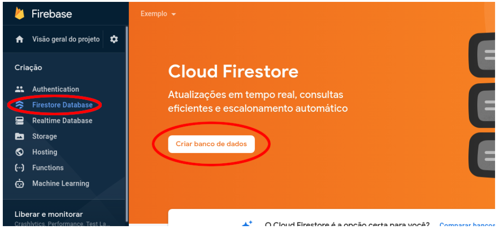
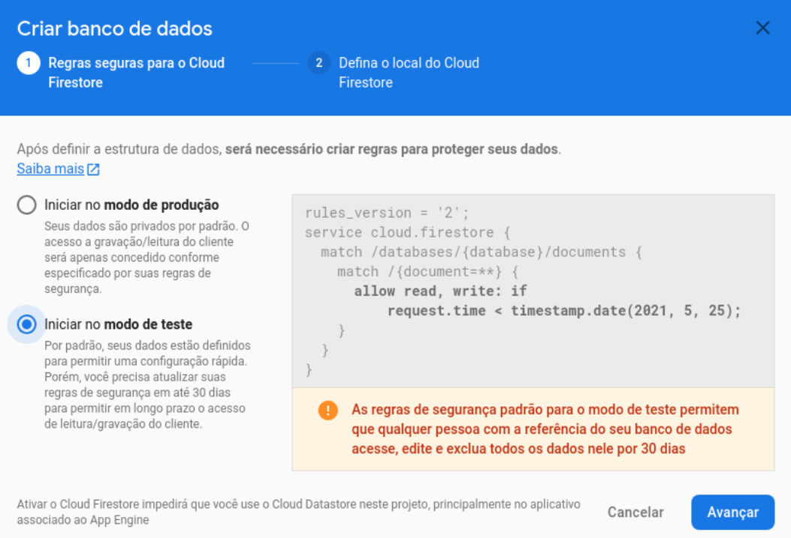
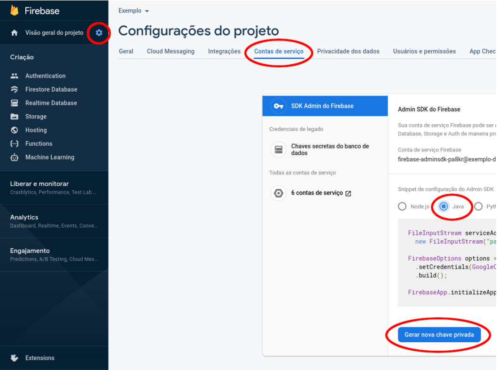
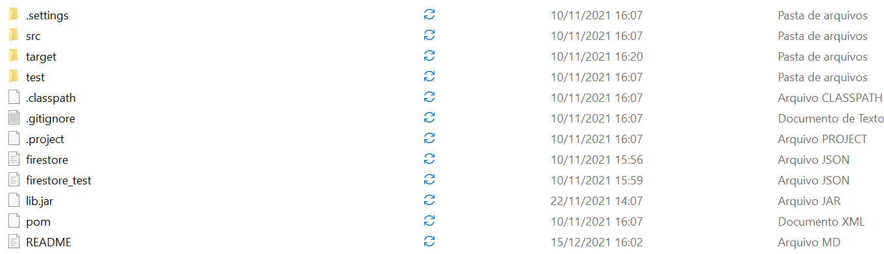
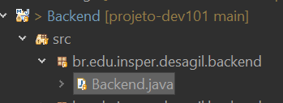
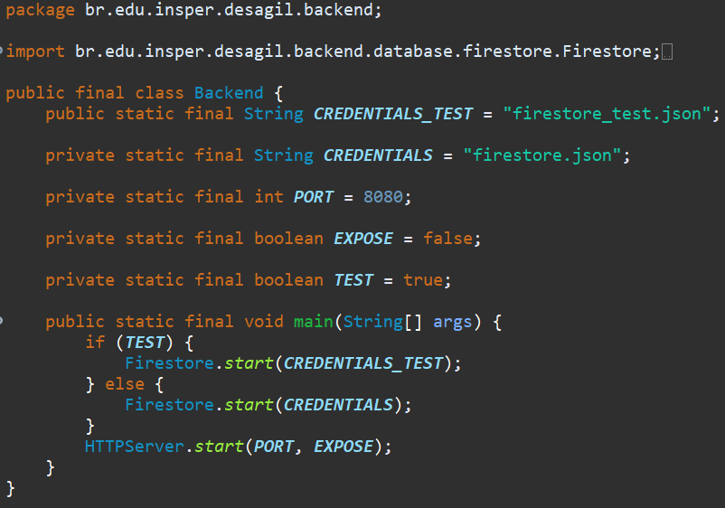

# Backend
Backend realizado em linguagem Java, na IDLE Eclipse.

## Para executar o Backend 

### Criando banco de dados
*Tutorial aproveitado do original feito pelo professor Marcelo Hashimoto.*

Entre no [console Firebase](https://console.firebase.google.com/u/0/) logado em uma conta Google, e clique em *Criar um projeto*:

De um nome ao projeto, e o crie. Chegando na Dashboard do Firebase, clique em **Firestore Database**, e depois em **Criar Banco de Dados**.

Crie o banco no modo de teste, e ative a configuração local padrão:

Ainda dentro do projeto, clique na engrenagem e selecione Configurações do projeto. Selecione a aba Contas de serviço, selecione a opção Java (ferramenta utilizada neste projeto) e clique em Gerar nova chave privada.

Gere a chave do banco e a baixe. Assim que baixar renomeie-a para **firestore_test.json** ou **firestore.json**, ambas são necessárias, mas a base de testes é utilizada por default.

Finalmente, mova estes arquivos para a pasta raiz do backend deste projeto:

### Executando banco de dados

Para executar o backend, importe esta pasta (Backend) na IDLE de sua preferência. Aqui estão dois tutoriais para importar no [Eclipse](https://www.ibm.com/docs/pt-br/rational-clearcase/9.0.0?topic=eclipse-importing-existing-project) ou no [IntelliJ IDEA](https://tiagotibaes.com/2021/06/03/importando-projeto-maven-no-intellij/#:~:text=Passo%2001%3A%20ao%20abrir%20o,Importante!). Outras IDLE's tem procedimentos parecidos.

Após importar, abra o projeto *Backend*, abra a *source foulder* **src**, e abra o package *br.edu.insper.desagil.backend*.
Irá aparecer o arquivo Backend.java, nele clique com botão direito, e clique em **run as**. Logo em seguida, clique em **Java Application**. 

Pronto, seu banco já está funcionando! Por default, ele executa na base de Testes, e em um endereço local. Caso deseja alterar essas configurações para uso personalizado, clique duas vezes sobre o arquivo Backend.java

Altere o atributo **EXPOSE** para *true*, caso deseje sua aplicação seja exposta em um endereço público na internet, permitindo interações com outros usuários externos.

Altere o atributo **TEST** para *false*, caso deseje utilizar a base de dados de produção na aplicação.

