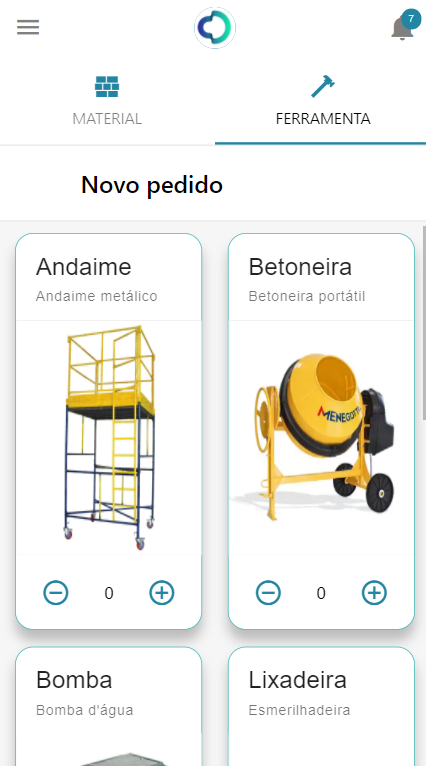

# Frontend
Frontend realizado em linguagem Javascript, em Framework React Native.

## Para executar o Frontend
Siga o tutorial descrito no arquivo README principal na sessão [*Para executar o Projeto*](https://github.com/hashiprobr-classroom/projeto-dev101/blob/main/README.md#para-executar-o-projeto-warning)
 É necessário ter instalado Node.js versão LTS.

*Alguns erros comuns de execução estão descritos [aqui](https://docs.npmjs.com/common-errors), e podem ser úteis em casos específicos*.

## Algumas das telas disponíveis na aplicação
<table>
  <tr>
    <td valign="top"></td>
    <td valign="top"></td>
    <td valign="top"></td>
  </tr>

  <tr>
    <td valign="top"></td>
    <td valign="top"></td>
    <td valign="top"></td>
  </tr>

  <tr>
    <td valign="top"></td>
    <td valign="top"></td>
    <td valign="top"></td>
  </tr>

  <tr>
    <td valign="top"></td>
    <td valign="top"></td>
    <td valign="top"></td>
  </tr>
</table>
