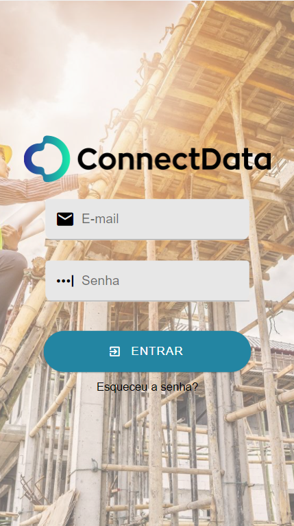
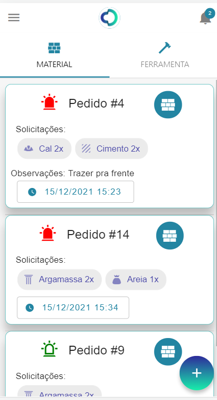
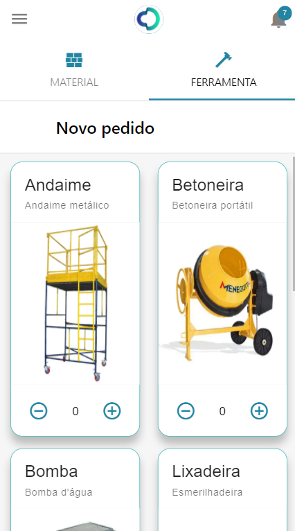
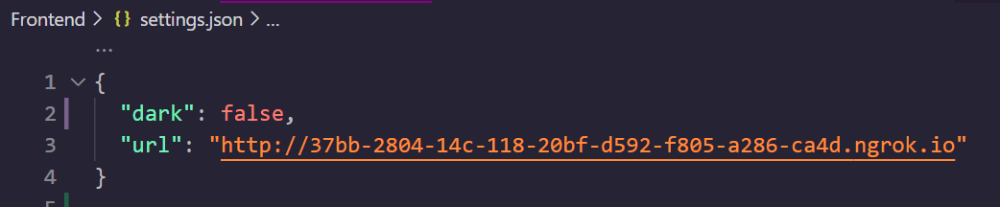
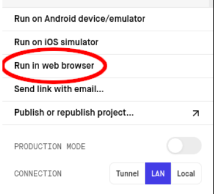

# Projeto 6: Controle de pedidos por indicadores
<div align="center" style="max-width:68rem;">


</div>
 <center></center>


Grandes empresas utilizam almoxarifados centrais próprios para fazer a distribuição
de materiais e ferramentas entre as obras. Para solicitar um transporte é comum
que o pedido seja efetuado via planilhas Excel. No entanto, esse controle é
desconexo do ERP da empresa ou outro sistema que conecte as informações de
maneira inteligente. O rastreamento automatizado permite gerar parâmetros de
boas práticas, definidas a partir de regras de negócio. Um aplicativo que se dedica à
consulta do registro de pedidos de materiais e à visualização de alertas,
discrepâncias e relatórios é uma ferramenta importante tanto para o usuário em
campo quanto para o gestor desse processo.


**Features requisitadas**: 
- Interface para adicionar ou retirar quantidades e efetuar observações;
- Registro de alterações no banco de dados;
- Verificação da lista de alterações pelo app.
<table>
  <tr>
    <td valign="top"></td>
    <td valign="top"></td>
    <td valign="top"></td>
  </tr>
</table>


<div align="center" style="max-width:68rem;">

# Desenvolvedores

<table>
  <tr>
    <td align="center"><a href="https://github.com/matheus-1618"><br /><sub><b>Matheus Oliveira</b></sub></a><br /><a href="https://github.com/matheus-1618" title="Matheus Oliveira"></a> Frontend Developer</td>
   <td align="center"><a href="https://github.com/Adneycm"><br /><sub><b>Adney Moura</b></sub></a><br /><a href="https://github.com/Adneycm" title="Adney Moura"></a>Frontend Developer</td>
   <td align="center"><a href="https://github.com/listerogusuku"><br /><sub><b>Lister Ogusuku</b></sub></a><br /><a href="https://github.com/listerogusuku" title="Lister Ogusuku"></a>Backend Developer</td>
   <td align="center"><a href="https://github.com/RicardoMourao-py"><br /><sub><b>Ricardo Mourão</b></sub></a><br /><a href="https://github.com/RicardoMourao-py" title="Ricardo Mourão"></a>Backend Developer</td>
  </tr>
</table>
</div>

## Para executar o projeto :warning:

*Abra um terminal de comando, digite o caminho onde deseja clonar o repositório e execute:*
```bash

git clone https://github.com/hashiprobr-classroom/projeto-dev101/

```
*Após clonar o repostório, crie dois bancos de dados (caso tenha algum, apenas renomeio-o) seguindo o [tutorial](./backend/README.md) neste sessão.*

*Após configurar o funcionamento adequado do Backend na sessão anterior, devemos agora executar o procedimento para execução do Frontend. Para este projeto é necessário ter instalado a versão LTS do Node.js (na data atual 14.18.2). Caso não tenha, pode instalar por este [link](https://nodejs.org/pt-br/download/).*

*Após instalar o Node.js, deve-se instalar o Explo CLI.*
*Caso use Windows ou Linux, execute o comando abaixo:*
```bash

npm install -g expo-cli

```
*Caso use Mac, execute o comando abaixo:*
```bash

sudo npm install -g expo-cli

```

*Para confirmar que o Expo CLI está instalado, rode o comando abaixo.*
```bash

expo

```

*Após Instalar o expo, devemos instalar as dependências do projeto via comando abaixo:*
```bash

npm install

```

*Caso algum erro seja encontrado, execute a linha abaixo para tratar problemas mais rasos.*
```bash

npm audit fix

```

*Após instalar o package do projeto, abra a pasta Frontend em uma IDLE de sua preferência (para desenvolvimento fora utilizada o Visual Studio Code), procure pelo arquivo JSON **settings.json** , e copie o endereço local (ou exposto) da API alimentada pelo Backend*
 <center></center>

 *Após colocar o endereço correto da execução, rode em um terminal de comando dentro da pasta de Frontend, o comando abaixo*:
 ```bash

npm start

```

*Deve-se, salvo possíveis erros, iniciar a execução remota do aplicativo. Em geral essa aplicação se inicia sozinha no navegador padrão da máquina, caso isto não ocorra, ela é executada por default no endereço local: http://localhost:19002/*

 <center></center>

*Após isso, para executar na sua máquina, utilizando-se de recursos de inspeção de tela para melhor dimensionamento, clique em **Run in web browser**, logo em seguida uma nova aba deve ser aberta com a aplicação rodando*.

*Caso deseje visualizar a aplicação no seu próprio dispositivo móvel, baixe o aplicativo **Expo GO**, e aponte sua câmera para o QR Code disponível na interface do Expo. Em geral, o aplicativo já deve rodar sem problemas, desde que, tanto o computador quanto o dispositivo estejam na mesma rede. Caso isso não ocorra, soluções possíveis podem ser:*
- **Alterar o endereço local do Backend para **EXPOSE**** e/ou;
- **Alterar parâmetro na interface do Expo, acima do QR Code de **LAN** para **Tunnel****. 

## Créditos
Todo arquétipo e escopo deste projeto deve-se as aulas e atendimentos dos professores Marcelo Hashimoto e Gustavo Calixto, que forneceram todos os recursos, seja o repositório base, tal qual fontes de pesquisa e aplicações simplificadas, que tornaram o desenvolvimento deste projeto menos complexo e mais interativo, sendo um ótimo caminho de início para o desenvolvimento Full Stack de aplicações.

Alguns recursos ou inspirações foram retiradas de alguns canais:
- [Custom Drawer Navigator](https://www.youtube.com/watch?v=ayxRtBHw754)
- [Login Screen](https://reactnativemaster.com/react-native-login-screen-tutorial/)

@2021, Insper, Terceiro Semestre, Engenharia da Computação.


